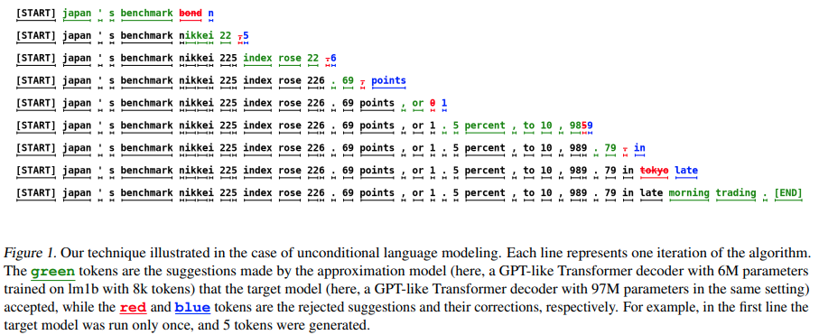

</img>

## Staged Speculative Decoding
Implementation of [Staged Speculative Decoding](https://arxiv.org/abs/2308.04623)

## Instructions
```
git clone https://github.com/Rohan138/staged-speculative-decoding.git
pip install -e .

# Make sure to run this! See https://github.com/pytorch/pytorch/pull/114083/files
bash fix_torch.sh

# See main.py for additional arguments
python main.py --wandb
```

## Changelog
- 11/23/2023: Initial commit

## TODO
- [ ] Choose and train draft and main models
- [ ] Benchmark autoregressive decoding from both models
- [ ] Implement and benchmark naive speculative decoding
- [ ] Add and benchmark trigram model
- [ ] Add tree-structured batches
- [ ] Benchmark against Medusa
- [ ] Add WanDB logging
- [ ] Add LLMPerf integration

## Acknowledgements

Initial implementation borrowed from [lucidrains/speculative-decoding](https://github.com/lucidrains/speculative-decoding)

```bibtex
@inproceedings{
spector2023accelerating,
title={Accelerating {LLM} Inference with Staged Speculative Decoding},
author={Benjamin Frederick Spector and Christopher Re},
booktitle={Workshop on Efficient Systems for Foundation Models @ ICML2023},
year={2023},
url={https://openreview.net/forum?id=RKHF3VYjLK}
}
```

```bibtex
@inproceedings{Leviathan2022FastIF,
    title   = {Fast Inference from Transformers via Speculative Decoding},
    author  = {Yaniv Leviathan and Matan Kalman and Y. Matias},
    booktitle = {International Conference on Machine Learning},
    year    = {2022},
    url     = {https://api.semanticscholar.org/CorpusID:254096365}
}
```

```bibtex
@article{Chen2023AcceleratingLL,
    title     = {Accelerating Large Language Model Decoding with Speculative Sampling},
    author    = {Charlie Chen and Sebastian Borgeaud and Geoffrey Irving and Jean-Baptiste Lespiau and L. Sifre and John M. Jumper},
    journal   = {ArXiv},
    year      = {2023},
    volume    = {abs/2302.01318},
    url       = {https://api.semanticscholar.org/CorpusID:256503945}
}
```

```bibtex
@misc{medusa,
    author     = {Tianle Cai and Yuhong Li and Zhengyang Geng and Hongwu Peng and Tri Dao},
    title      = {Medusa: Simple Framework for Accelerating LLM Generation with Multiple Decoding Heads},
    year       = {2023},
    publisher  = {GitHub},
    journal    = {GitHub repository},
    howpublished = {\url{https://github.com/FasterDecoding/Medusa}},
}
```
